# NHI Sentinel — Evidence-Led NHI & AI-Agent Identity Assessment

**An agentic assessment platform that inventories non-human identities across AWS, Entra, GitHub and AI-agent registries, runs deterministic checks backed by signed evidence, and refuses to publish a single claim it cannot cite — scored honestly, released only through a two-person gate.**

    

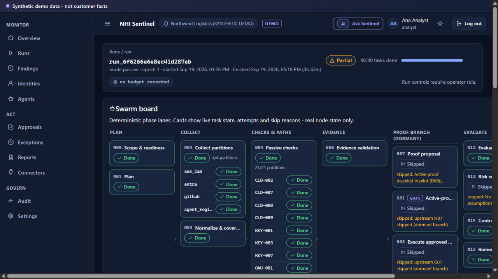

The swarm board is the real run state — phase lanes, per-source partitions, attempts, skip
reasons, the dormant proof branch and the G02 human gate. No fabricated progress bars: if a
card says Done, a durable task row says Done.

## What this is

NHI Sentinel implements the *NHI Sentinel Revised Blueprint v2* as a working vertical slice
(226/475 blueprint IDs traced in [docs/TRACEABILITY.md](docs/TRACEABILITY.md)):

- **Durable collection swarm** — a run DAG (`N00 → N17`) executed by a persistent engine:
  bounded retries, lease-based dispatch, skip propagation for dormant branches, fan-in at
  every join, and an independent kill path checked before each dispatch
- **4 pilot connectors** — AWS IAM, Entra ID, GitHub and agent-registry imports with envelope
  validation, secret redaction at ingest, completeness from real collection errors (a 403 page
  error makes the snapshot *partial*, never "complete"), and SHA-256 + HMAC signed manifests
- **21 certified checks** across cloud, credentials, OAuth consent, CI/CD and **AI-agent
  identity governance** (the differentiator: unregistered agents, delegation amplification,
  MCP audience gaps, missing kill switches) — every check ships pass/fail/unknown fixtures
- **Evidence over narrative** — a fail without resolvable, signature-valid artifacts is
  downgraded with an audit trail; reports are assembled as claim→evidence registries and
  **grounding validation blocks release** on any unsupported claim
- **Deterministic severity, honest scores** — severity rules are versioned and pinned per run
  (fail-closed on unknown bundles); the posture score shows per-dimension pass rates with
  visible completeness and **withholds the aggregate** when detection is unexercised or a
  source is partial — never invents a score
- **Two-person everything** — report release (author ≠ reviewer, re-authenticated, digest-bound
  signature) and dormant proof proposals whose approval demonstrably *cannot* enable execution
  in pilot
- **A live control room** — 13 zero-build views on one SSE stream: mission control, the swarm
  board, findings triage, exceptions queue, approvals, agents, connectors, audit with chain
  verification, and a citation-only assistant that cannot act

All demo data is synthetic and labeled; active proof is disabled by design (Decision D06).

## The control room

Mission control opens on coverage and freshness, not vanity numbers:

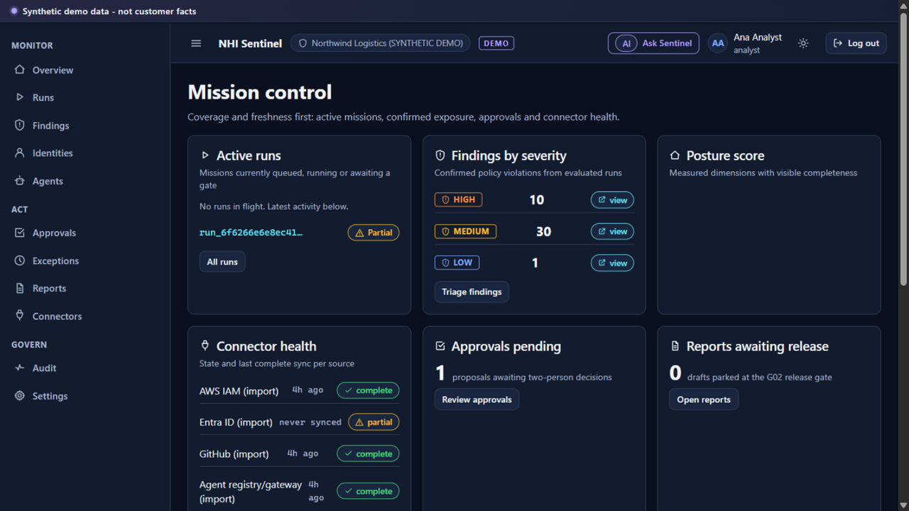

The findings triage table and the evidence-led finding drawer — every claim in a finding
links to a signed artifact:

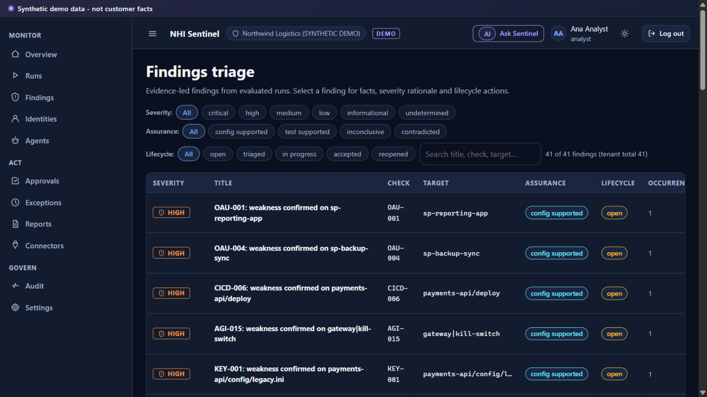

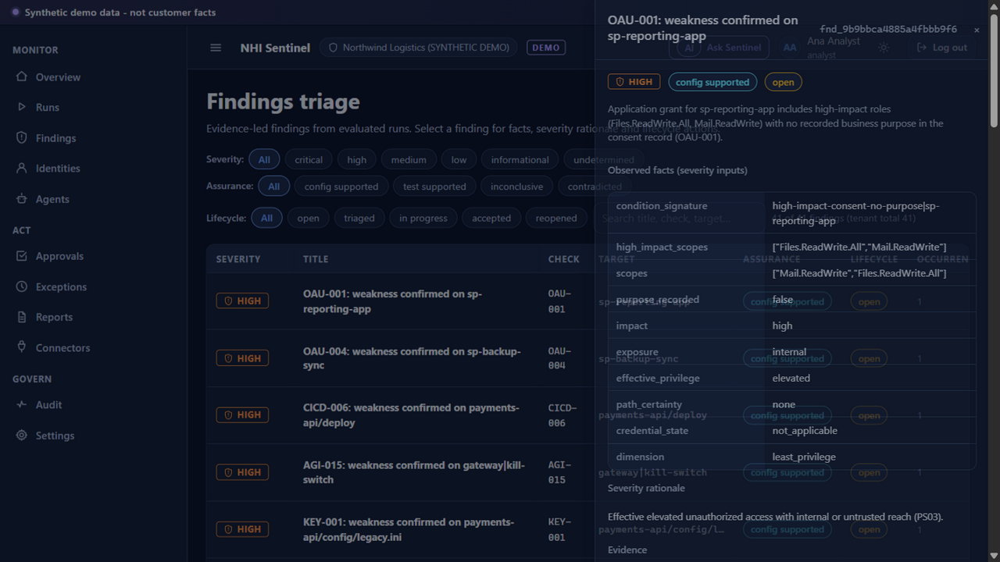

Risk exceptions are time-bounded and independently decided — the requester cannot approve
their own exception, and expiry reopens the finding automatically:

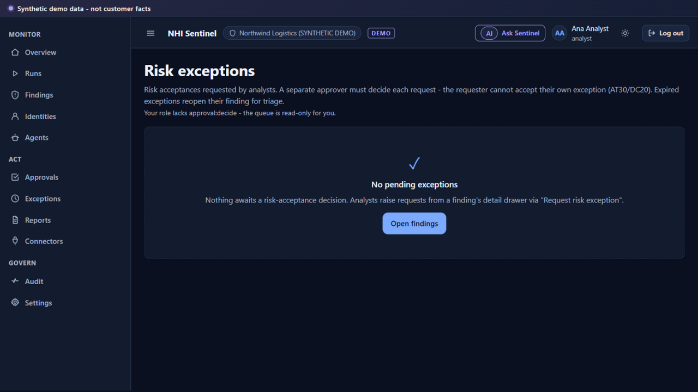

The approvals inbox enforces the two-person rule with re-authentication, and even a fully
approved sandbox proof cannot execute in pilot (D06):


Reports carry their grounding status; released revisions are immutable and export with
formula-safe CSV/JSON:

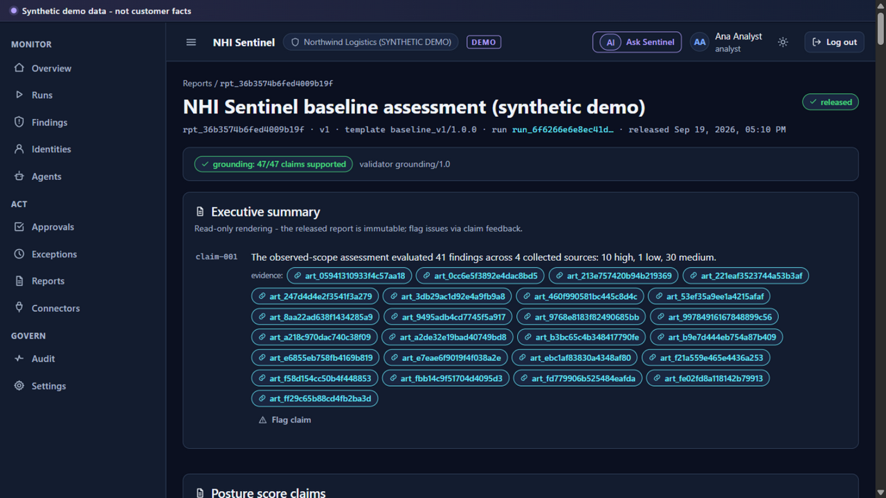

Agent governance distinguishes registered identities from observed shadow agents; connectors
report normalization outcomes (never bare HTTP 200s); the audit log is a hash chain you can
verify from the UI:

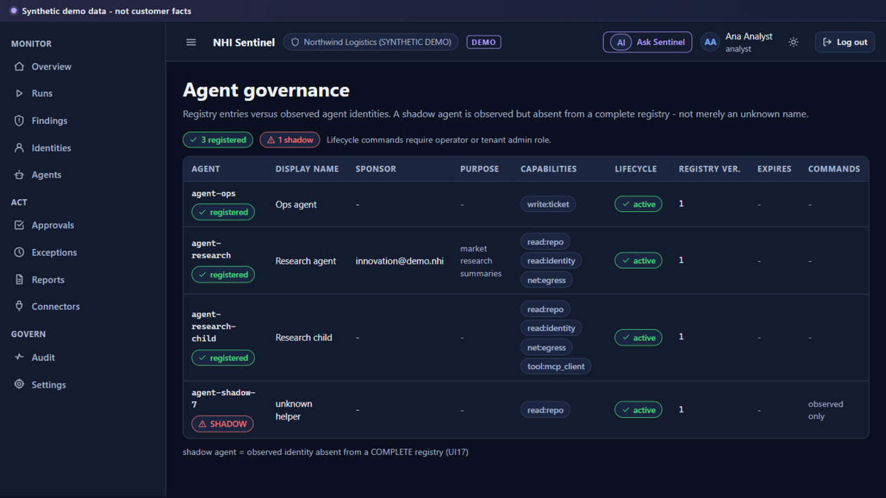

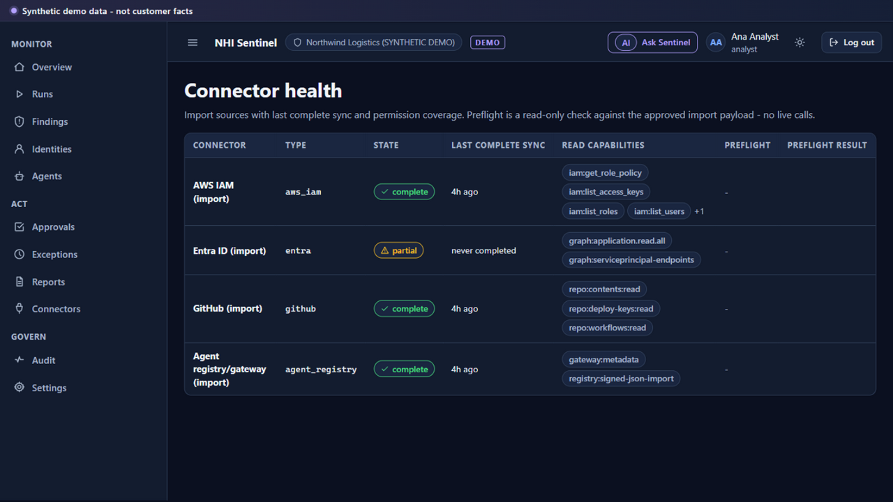

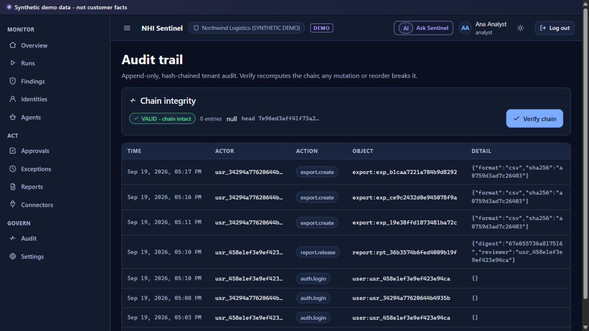

Settings expose the tenant kill flag, continuous-monitoring subscriptions and the (guarded)
offboarding flow:

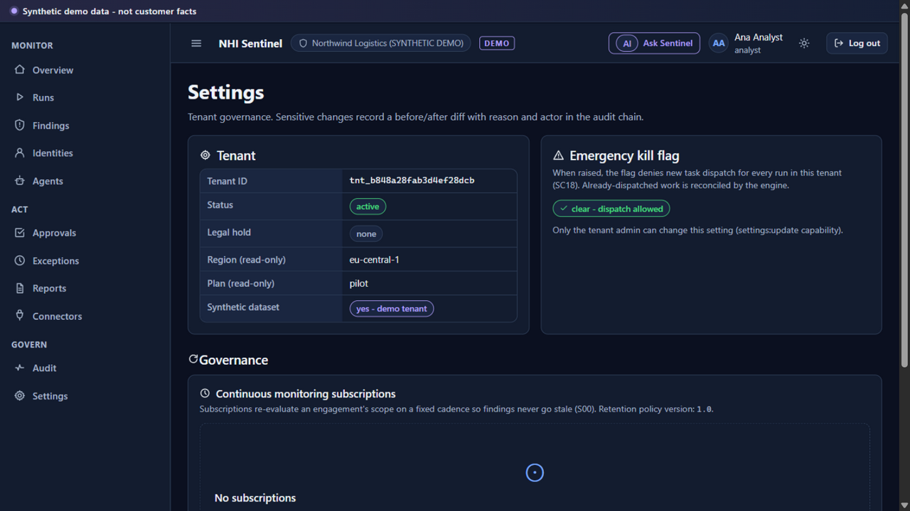

Ask Sentinel answers from run data only — every answer carries citations; instruction text
inside a question is treated as data, never as command:

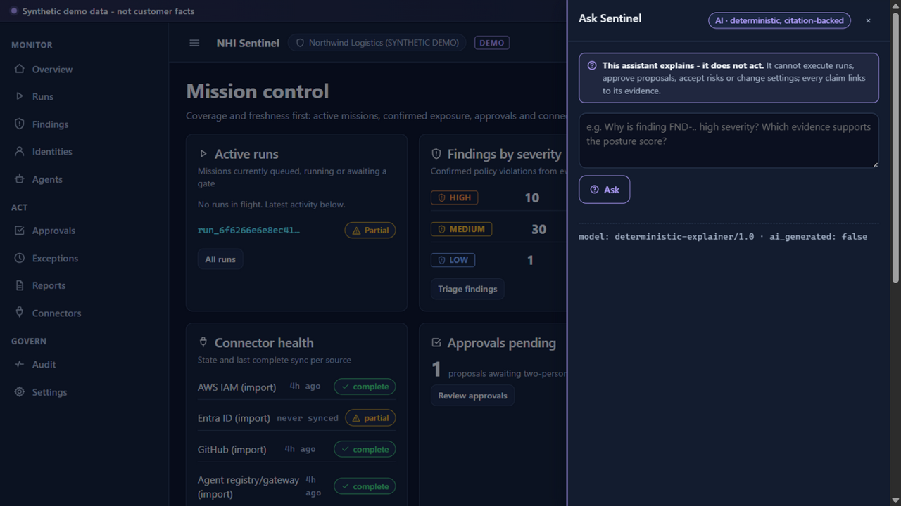

## Quickstart

Prerequisites: **Python 3.12+**. No databases, no Node build, no API keys — the demo corpus
is bundled and the assistant runs as a deterministic citation engine.

```bash
pip install -e .            # or: pip install fastapi uvicorn sqlalchemy pydantic pydantic-settings

python run_demo.py reseed   # fresh synthetic tenant + demo users + approved scope
python run_demo.py serve    # portal http://127.0.0.1:8650/portal · API docs /api-docs
```

One-command pipeline check without the server:

```bash
python run_demo.py headless # drives a full run to the release gate and prints findings
```

**Demo logins** (password `demo-synthetic-only`): `analyst@demo.nhi`, `reviewer@demo.nhi`,
`approver1@demo.nhi`, `approver2@demo.nhi`, `operator@demo.nhi`, `viewer@demo.nhi`,
`auditor@demo.nhi`, `admin@demo.nhi` — plus `intruder@contoso.nhi`, the tenant-B analyst the
isolation tests attack with.

Container alternative: `docker compose -f docker-compose.dev.yml up` (builds the image,
mounts the repo, persists data in a named volume).

### The 15-minute tour

1. Sign in as **analyst** → Overview shows coverage, honest score dimensions and connector health
2. Open **Runs** → the parked assessment → watch the swarm board and the event timeline (SSE)
3. Open **Findings** → pick a `high` finding → inspect its facts, rationale and evidence
4. **Request risk exception** on a finding → switch to **approver1** → Exceptions → accept it
5. As **reviewer**, open Reports → the draft parked at gate G02 → release it with review
   record + password (the analyst who created it cannot)
6. Export CSV/JSON from the released report — counts reconcile, formulas are neutralized
7. As **admin**, visit Settings → governance, subscriptions, and the offboarding danger zone
8. Finish in **Audit** → "Verify chain" — every governance action above is chained

## Scoring honestly

The scorecard is designed to be *unflattering*. Each dimension reports
`pass rate × weight` **only over assessed targets**, with completeness published beside it:

- Unknown and error outcomes never count as pass — they are visible gaps in the denominator
- A partial source snapshot marks completeness as an estimate and shows the PARTIAL badge
- With detection scenarios unexercised (the pilot has none — active testing is disabled), the
  **aggregate score is withheld** and the UI says exactly why
- Severity is a persisted policy decision (`policy_version` + input hash), never an LLM output;
  missing essential inputs yield `undetermined`, not a guessed Low

## Security model

- **Tenant isolation** — every repository access is tenant-bound; cross-tenant reads return
  404 without metadata leakage (tested, AT01); Postgres FORCE-RLS migration ships in
  [docs/migrations/001_postgres_rls.sql](docs/migrations/001_postgres_rls.sql)
- **Sessions** — HttpOnly cookies, server-side revocation, CSRF tokens on every mutation,
  strict CSP/HSTS/nosniff on every response
- **Roles** — viewer/analyst/operator/approver/reviewer/auditor/tenant-admin with a
  server-side capability matrix; the UI mirrors it but the server is authoritative
- **Secrets** — fixture values are redacted before durable ingest; only keyed fingerprints are
  stored; the UI shows fingerprint prefixes
- **Audit** — append-only hash chain walked in insertion order; tamper with one row and
  verification fails (tested)
- **Independent containment** — tenant and run kill flags deny dispatch before every task;
  approval never becomes capability (tested: a two-person-approved proof still cannot execute)

## Repo layout

```
nhi_sentinel/
  contracts/    DC01–DC22 models + run/task state machines (EX01/EX02)
  core/         DB schema (EX08 indexes), tenant-scoped repo, auth/roles, signing, audit, SSE
  connectors/   import-connector framework + AWS/Entra/GitHub/agent-registry adapters
  checks/       check contract + 21 registered pilot checks
  policies/     deterministic severity (PS01–PS05) + score (PS06–PS11)
  worker/       durable engine + DAG node handlers + control mappings/runbooks
  reports/      deterministic report builder + grounding validator
  api/          FastAPI control API + SSE + portal hosting
web/            zero-build control-room SPA (dark/light tokens, 13 views)
fixtures/       synthetic golden corpus (labeled NOT customer data)
tests/          76 pytest tests mapping blueprint acceptance tests
docs/           blueprint + extracted requirement index, ADRs, UAT plan/results, SBOM, migrations
scripts/        traceability + SBOM generators, UAT driver
```

## For the next engineer

Start here: read the workbook's *Start Here* sheet
(`docs/blueprint/NHI_Sentinel_Revised_Blueprint_v2.xlsx`) and the ADRs in `docs/adr/` — they
explain *why* the stack deviates from the blueprint where it does.

**Add a check** (the most common task): subclass `Check` in `nhi_sentinel/checks/`, set
`id/version/dimension/applies_to`, implement `run(view)` returning `CheckOutcome`s with
`condition_signature` + the five standard severity inputs, register with `@register`, then add
a fixture scenario to `docs/scenario_matrix.md` and a golden row to
`tests/golden/expected_outcomes.json`. The AT27 golden runner will enforce it.

**Add a connector**: subclass `ImportConnector` in `nhi_sentinel/connectors/adapters.py`,
implement `validate_payload` + `normalize` (envelope schema is fixed), add a synthetic fixture,
and register it in the seed. Live SDK collectors replace imports behind the same contract —
certification fixtures already exist.

**Wire the LLM** (optional, off by default): the plan node and assistant are deterministic
with recorded model versions; a provider may only rewrite *grounded* sections and must pass
the AT40-style regression tests (injection + citation checks) before promotion.

**Gotchas** (learned the hard way, see ADRs): never open a nested `session_scope` inside an
open transaction — pass the ambient session; the audit head must be read fresh, not from a
transaction snapshot, and chains walk in insertion order; fan-in gating keys on
*insertion-ordered* terminal parents; partial snapshots must never imply deletion.

## Testing, CI & UAT

```bash
python -m pytest -q        # 76 tests; tenant isolation, two-person approvals, containment,
                           # grounding, custody, score math, golden outcomes
python scripts/gen_traceability.py   # requirement ID -> code/test matrix
python scripts/gen_sbom.py           # regenerate docs/sbom.json
```

CI runs the suite on push/PR (`.github/workflows/ci.yml`) with a stubbed postgres-rls job;
`Dockerfile` + `docker-compose.dev.yml` build the stack.

Full UAT (82 cases, every screen and control) is documented in
[docs/UAT_RESULTS.md](docs/UAT_RESULTS.md) — 100% final pass, with the two real bugs it
caught (emergency-stop validation, stale client CSRF) fixed and regression-covered.

## Deferred by design

Live vendor SDK collectors (import adapters are certified against the import schema until
sandbox certification), Postgres deployment (SQLite dev + RLS migration shipped), the active
proof executor (approvals machinery built, execution disabled per D06), the S00 delta
scheduler's true delta APIs, React/TS portal parity, LangGraph/OPA engines — each documented
in [docs/adr/](docs/adr/) with its migration path.

## Documentation map

| Doc | Purpose |
|---|---|
| [docs/IMPLEMENTATION_LOG.md](docs/IMPLEMENTATION_LOG.md) | per-slice report: what was built, bugs fixed, honest status |
| [docs/TRACEABILITY.md](docs/TRACEABILITY.md) | blueprint requirement ID → code/test matrix |
| [docs/blueprint/requirements.json](docs/blueprint/requirements.json) | 475 extracted requirement IDs from the v2 workbook |
| [docs/adr/](docs/adr/) | architecture decisions and deliberate deviations |
| [docs/UAT_PLAN.md](docs/UAT_PLAN.md) / [docs/UAT_RESULTS.md](docs/UAT_RESULTS.md) | UAT procedure and results |
| [docs/migrations/001_postgres_rls.sql](docs/migrations/001_postgres_rls.sql) | pilot-gate tenant isolation migration |
